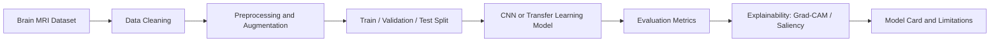

<div align="center">

# Brain Tumor Classification

### Medical imaging AI repository for brain MRI classification workflows


</div>

---

## Overview

**Brain Tumor Classification** is a medical imaging AI repository intended for building, documenting, and extending deep-learning workflows for classifying brain MRI images. It fits within Dr. Alok Tiwari's broader research interests in **medical imaging AI, computer vision, transfer learning, weakly supervised learning, explainable AI, and healthcare analytics**.

This repository should be treated as an educational and research-development project, not as a clinical diagnostic product.

---

## Problem Statement

Brain tumor classification from MRI scans is a high-impact computer vision problem where machine learning models can support radiology workflows by organizing images, identifying suspicious patterns, and assisting downstream decision-making.

A well-documented project in this area should demonstrate:

- reproducible preprocessing
- careful dataset handling
- model training and validation
- explainability for image-level predictions
- limitations and ethical boundaries
- clinically cautious interpretation

---

## Intended Workflow



---

## Suggested Project Structure

```text
brain_tumor_classification/
├── data/                  # Dataset instructions only; avoid committing sensitive data
├── notebooks/             # Exploratory and training notebooks
├── src/                   # Reusable Python modules
│   ├── preprocessing.py
│   ├── train.py
│   ├── evaluate.py
│   └── explain.py
├── models/                # Saved model checkpoints, if appropriate
├── reports/               # Metrics, plots, and visual explanations
├── requirements.txt
├── README.md
└── LICENSE
```

---

## Recommended Methods

| Component | Options |
|---|---|
| Baseline Models | CNN, ResNet, VGG, DenseNet, EfficientNet |
| Training Frameworks | PyTorch or TensorFlow/Keras |
| Preprocessing | resizing, normalization, augmentation, skull/background handling if needed |
| Evaluation | accuracy, precision, recall, F1-score, ROC-AUC, confusion matrix |
| Explainability | Grad-CAM, saliency maps, occlusion sensitivity |
| Deployment Direction | Streamlit demo, FastAPI inference endpoint, or notebook-based workflow |

---

## Example Installation

```bash
git clone https://github.com/dr-alok-tiwari/brain_tumor_classification.git
cd brain_tumor_classification
python -m venv .venv
source .venv/bin/activate
pip install -r requirements.txt
```

For Windows PowerShell:

```powershell
python -m venv .venv
.venv\Scripts\Activate.ps1
pip install -r requirements.txt
```

---

## Example Training Command

```bash
python src/train.py --data_dir data/processed --model resnet50 --epochs 30 --batch_size 32
```

---

## Example Evaluation Command

```bash
python src/evaluate.py --model_path models/best_model.pt --test_dir data/test
```

---

## Responsible AI and Clinical Safety Note

This repository is for **research, teaching, and prototyping**. It is not a validated medical device and must not be used for clinical diagnosis without rigorous validation, regulatory review, clinician oversight, and institutional approval.

Any model trained for medical imaging should report:

- dataset source and inclusion criteria
- preprocessing and augmentation steps
- train/validation/test split design
- class imbalance handling
- external validation status
- subgroup performance if available
- known failure modes
- explainability outputs
- intended and non-intended uses

---

## Recommended Next Improvements

- [ ] Add dataset source and citation
- [ ] Add reproducible training notebook
- [ ] Add `requirements.txt`
- [ ] Add sample confusion matrix and ROC curve
- [ ] Add Grad-CAM visualizations
- [ ] Add model card
- [ ] Add Streamlit demo for educational inference
- [ ] Add license
- [ ] Add citation metadata with `CITATION.cff`

---

## Academic Context

This repository aligns with Dr. Alok Tiwari's work in:

- medical imaging AI
- deep learning for radiological image analysis
- transfer learning for small and specialized datasets
- explainable AI for clinical decision support
- healthcare analytics education

---

## Author

**Dr. Alok Tiwari**  
Assistant Professor, Big Data Analytics  
Goa Institute of Management, Goa  

- Portfolio: [dr-alok-tiwari.github.io](https://dr-alok-tiwari.github.io/)
- GitHub: [@dr-alok-tiwari](https://github.com/dr-alok-tiwari)
- Google Scholar: [jE6HZ0gAAAAJ](https://scholar.google.com/citations?user=jE6HZ0gAAAAJ)

---

<div align="center">

**Medical Imaging AI · Brain MRI · Deep Learning · Explainable Healthcare AI**

</div>
